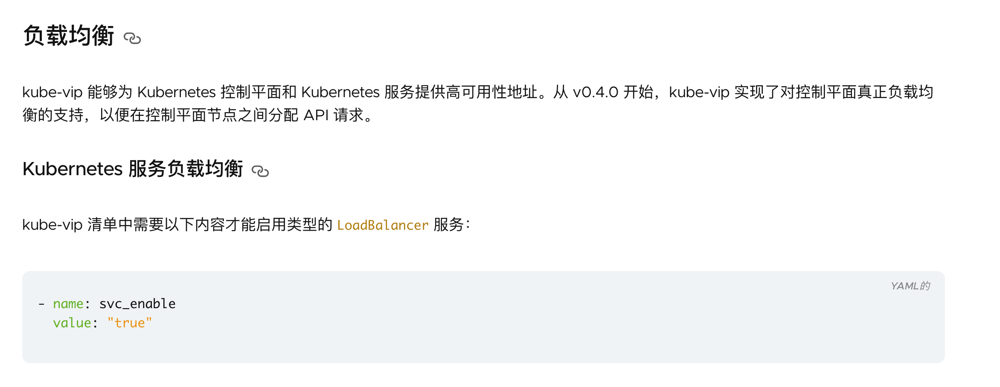
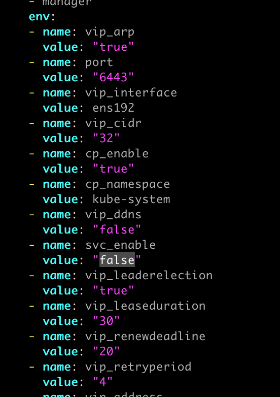

# kube-vip 与 MetalLB LoadBalancer Layer2 ARP冲突

### 问题描述

在启动了kube-vip Layer2模式的kubernetes HA集群，安装了MetalLB并使用Layer2模式转发service LoadBalancer到集群外部时，LoadBalancer IP不能被访问。

#### 原因（猜测，日志无报错）

ARP表冲突，kube-vip默认启用了Service LoadBalancer模式（后面文章再研究），导致MetalLB申请的IP不能被ARP解析。
kube-vip官网找到以下内容：



### 解决方案

关闭kube-vip的LoadBalancer，只使用MetalLB提供的LB能力。

```
vim /etc/kubernetes/manifests/kube-vip.yaml
```

重启所有master的kubelet

```
systemctl restart kubelet
```

### 删除vip重新生成

```
不确定有没有作用，先写上
# 所有master都执行
ip addr del dev ens192 10.20.13.111/32
```

> ens192：网卡
>
> 10.20.13.111/32：vip

### 测试

经过以上步骤，此时再次访问vip，还是不通，原因我猜测是ip已经被写入ARP表还未过期，可以新增一个LoadBalancer模式的Service

#### 方法一

```
将不通的LoadBalancer IP作为源地址发送请求到k8s节，以此来刷新ARP表
arping -I ens192 -s 10.20.13.231 10.20.13.90
```

> 10.20.13.90：master ip其中之一（任意节点应该也可以）
>
> 10.20.13.231：不通的LoadBalancer IP

#### 方法二

`新增service，使用一个之前未使用过的LoadBalancer`

示例：

```
kubectl expose deployment nginx-deployment --type=LoadBalancer --port=80 --name=nginx-lb
```

> nginx-deployment：deployment名称
