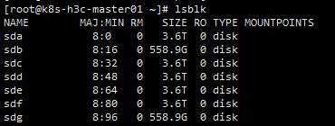
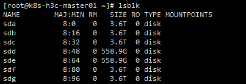
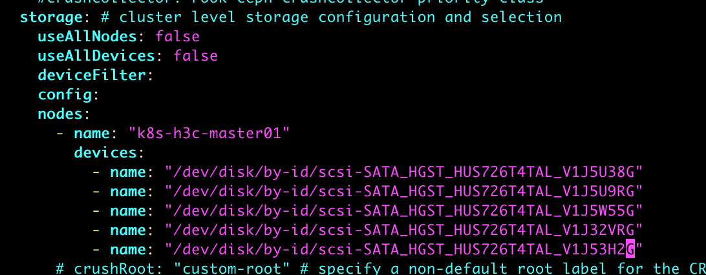

# 【故障排查】Linux重启后磁盘号错乱问题

### 问题描述

> linux拥有多块磁盘设备，重启后磁盘号更换，导致使用/dev/sda挂载的文件切换到其他磁盘号。

重启前：



重启后：



### 解决方案

#### 文件系统（须分区）

##### 方式一：使用UUID（推荐）

```shell
# 查看分区UUID
blkid
# 或者
lsblk -o name,maj:min,rm,size,ro,type,mountpoint,label,uuid
# 修改前
/dev/sdb1       /data0       xfs       defaults       1 2
# 修改后
UUID=79ba7c2e-23da-405e-95c0-6cdd215a984a       /data0       xfs       defaults       1 2
```

##### 方式二：使用LABEL（只能是ext2、ext3、ext4分区类型，不支持xfs分区）

```shell
e2label /dev/sdb1 labelname
# 修改前
/dev/sdb1       /data0       xfs       defaults       1 2
# 修改后
LABEL=labelname       /data0       ext4       defaults       1 2
```

#### 块设备

块设备是没有分区的裸盘，并没有UUID，可以使用设备id

```
ll /dev/disk/by-id/
lrwxrwxrwx 1 root root  9 Jul 15 21:36 ata-HGST_HUS726T4TALE6L4_V1J32VRG -> ../../sdf
lrwxrwxrwx 1 root root  9 Jul 15 21:36 ata-HGST_HUS726T4TALE6L4_V1J53H2G -> ../../sde
lrwxrwxrwx 1 root root  9 Jul 15 21:36 ata-HGST_HUS726T4TALE6L4_V1J5U38G -> ../../sda
lrwxrwxrwx 1 root root  9 Jul 15 21:36 ata-HGST_HUS726T4TALE6L4_V1J5U9RG -> ../../sdb
lrwxrwxrwx 1 root root  9 Jul 15 21:36 ata-HGST_HUS726T4TALE6L4_V1J5W55G -> ../../sdg
...
# more
...
lrwxrwxrwx 1 root root  9 Jul 15 21:36 scsi-SATA_HGST_HUS726T4TAL_V1J32VRG -> ../../sdf
lrwxrwxrwx 1 root root  9 Jul 15 21:36 scsi-SATA_HGST_HUS726T4TAL_V1J53H2G -> ../../sde
lrwxrwxrwx 1 root root  9 Jul 15 21:36 scsi-SATA_HGST_HUS726T4TAL_V1J5U38G -> ../../sda
lrwxrwxrwx 1 root root  9 Jul 15 21:36 scsi-SATA_HGST_HUS726T4TAL_V1J5U9RG -> ../../sdb
lrwxrwxrwx 1 root root  9 Jul 15 21:36 scsi-SATA_HGST_HUS726T4TAL_V1J5W55G -> ../../sdg
lrwxrwxrwx 1 root root  9 Jul 15 21:36 scsi-STOSHIBA_AL15SEB060N_Y0T0A2UYFM9F -> ../../sdd
lrwxrwxrwx 1 root root  9 Jul 15 21:36 scsi-STOSHIBA_AL15SEB060N_Y0T0A30YFM9F -> ../../sdc
```

> 重复的既有ata和scsi随便选一个就行，都是指向同一个设备文件，我这里选scsi

示例（ceph实例 ）：


