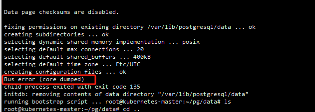

# 【故障排查】Postgre启动失败：Bus error (core dumped)

### **问题描述**

```
Bus error (core dumped) 
child process exited with exit code 135
```



### **修复**

```
在pod所在节点操作
# 临时设置
sysctl -w vm.nr_hugepages=0
cat /proc/sys/vm/nr_hugepages
# 永久设置
sed -i 's/vm.nr_hugepages = 250/vm.nr_hugepages = 0/g' /etc/sysctl.conf
sysctl --system
```

### **参考链接**

[Error 135 in Initdb deploying inside Kubernetes · Issue #451 · docker-library/postgres (](https://github.com/docker-library/postgres/issues/451)[github.com](http://github.com)[)](https://github.com/docker-library/postgres/issues/451)

[postgresql - Kubernetes Postgres Bus error (core dumped) - Stack Overflow](https://stackoverflow.com/questions/67941955/kubernetes-postgres-bus-error-core-dumped)
