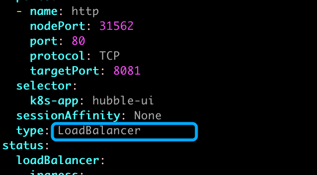
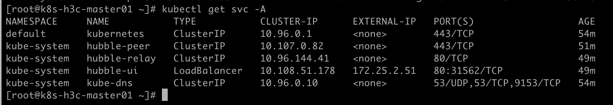

# 使用kube-vip实现LoadBalancer（Layer2模式）

### 前提条件

- kube-vip

### 安装云控制管理器

官方文档：[On-Premises (kube-vip-cloud-controller) | kube-vip](https://kube-vip.io/docs/usage/cloud-provider/#using-the-kube-vip-cloud-provider)

```
wget https://github.com/kube-vip/kube-vip-cloud-provider/blob/v0.0.10/manifest/kube-vip-cloud-controller.yaml
kubectl apply -f kube-vip-cloud-controller.yaml
```

### 创建CIDR

#### 快速配置，创建全局LB网段

```
kubectl create configmap -n kube-system kubevip --from-literal range-global=172.25.2.51-172.25.2.100
```

#### 高级配置

```
apiVersion: v1
kind: ConfigMap
metadata:
  name: kubevip
  namespace: kube-system
data:
  cidr-default: 192.168.0.200/29                      # default命名空间CIDR
  range-development: 192.168.0.210-192.168.0.219      # development命名空间IP池
  cidr-finance: 192.168.0.220/29,192.168.0.230/29     # finance命名空间CIDR
  cidr-global: 192.168.0.240/29                       # 全局CIDR
```

> 如果service不使用kube-vip提供的LB，在`servicemetadata.annotations`处配置`kube-vip.io/ignore=true`  告诉kube-vip 忽略掉这个服务

### 设置service为LoadBalancer

```
kubectl edit svc -n namespace svc
```





### 配合MetalLB使用kube-vip

原文地址：[【故障排查】kube-vip 与 MetalLB LoadBalancer Layer2 ARP冲突 - Elijah Blog (](https://sreok.cn/archives/81eb2a31-1b61-4331-bf40-098cbd20624c)[sreok.cn](http://sreok.cn)[)](https://sreok.cn/archives/81eb2a31-1b61-4331-bf40-098cbd20624c)

原文地址：[使用MetalLB为k8s集群提供负载均衡服务（Layer 2模式） - Elijah Blog (](https://sreok.cn/archives/f0b5ce93-4404-4ed3-a3b8-a0745ff8cc23)[sreok.cn](http://sreok.cn)[)](https://sreok.cn/archives/f0b5ce93-4404-4ed3-a3b8-a0745ff8cc23)
