# 使用rook在k8s集群部署ceph（yaml方式）

## 前提条件

- k8s 集群
- 节点挂载空盘用于ceph osd

下载源文件，本文档是1.14.1[Source code (tar.gz) (github.com)](https://github.com/rook/rook/archive/refs/tags/v1.14.1.tar.gz)

`解压进入deploy/examples目录，以下操作如果没有说明，都是在examples目录下操作`

## 部署

### 部署operator

##### 打开自动发现

修改operator.yaml 中的ROOK_ENABLE_DISCOVERY_DAEMON为true

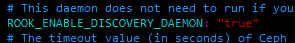

##### 修改镜像地址

国内访问不到google地址，使用`修改为阿里云地址`，我这里使用私有仓库，只要保证可以拉取到即可。

```yaml
ROOK_CSI_CEPH_IMAGE: "registry.aliyuncs.com/google_containers/cephcsi:v3.10.2"
ROOK_CSI_REGISTRAR_IMAGE: "registry.aliyuncs.com/google_containers/csi-node-driver-registrar:v2.9.1"
ROOK_CSI_RESIZER_IMAGE: "registry.aliyuncs.com/google_containers/csi-resizer:v1.9.2"
ROOK_CSI_PROVISIONER_IMAGE: "registry.aliyuncs.com/google_containers/csi-provisioner:v3.6.3"
ROOK_CSI_SNAPSHOTTER_IMAGE: "registry.aliyuncs.com/google_containers/csi-snapshotter:v6.3.2"
ROOK_CSI_ATTACHER_IMAGE: "registry.aliyuncs.com/google_containers/csi-attacher:v4.4.2"
```

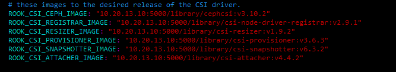

##### 开始部署

```shell
 kubectl apply -f crds.yaml -f common.yaml -f operator.yaml
```

等待所有pod运行

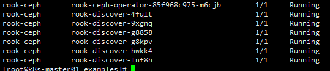

如果这是你第一次安装，不需要初始化，否则需要将磁盘清空。`谨慎操作!!!`

```shell
DISK=$1

# Zap the disk to a fresh, usable state (zap-all is important, b/c MBR has to be clean)
sgdisk --zap-all $DISK

# Wipe a large portion of the beginning of the disk to remove more LVM metadata that may be present
dd if=/dev/zero of="$DISK" bs=1M count=100 oflag=direct,dsync

# SSDs may be better cleaned with blkdiscard instead of dd
blkdiscard $DISK

# Inform the OS of partition table changes
partprobe $DISK

# This command hangs on some systems: with caution, 'dmsetup remove_all --force' can be used
ls /dev/mapper/ceph-* | xargs -I% -- dmsetup remove % &> /dev/null

# ceph-volume setup can leave ceph-<UUID> directories in /dev and /dev/mapper (unnecessary clutter)
rm -rf /dev/ceph-*
rm -rf /dev/mapper/ceph--*
rm -rf /var/lib/rook/
```

集群中每个节点都运行以上脚本初始化磁盘

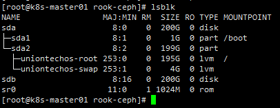

```shell
./cleanup.sh /dev/sdx # 将sdb盘清空，并删除ceph遗留文件
```

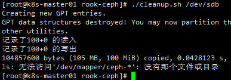

### 部署集群

修改cluster.yaml文件中的storage，如果想使用集群中所有的节点上的所有存储，使用默认配置即可

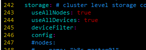

同时支持定义指定节点指定磁盘。如下，指定k8s-master01、2、3中的sd开头的磁盘

```yaml
storage: # cluster level storage configuration and selection
    useAllNodes: false
    useAllDevices: false
    deviceFilter:
    config:
    nodes:
      - name: "k8s-master01"
        deviceFilter: "^sd."
      - name: "k8s-master02"
        deviceFilter: "^sd."
      - name: "k8s-master03"
        deviceFilter: "^sd."
```

如果指定单个磁盘

```yaml
storage: # cluster level storage configuration and selection
    useAllNodes: false
    useAllDevices: false
    config:
    nodes:
      - name: "k8s-master01"
        devices: 
          - name: "sdb"
      - name: "k8s-master02"
        devices: 
          - name: "sdb"
      - name: "k8s-master03"
        devices: 
          - name: "sdb"
```

开始部署

```
kubectl apply -f cluster.yaml
```

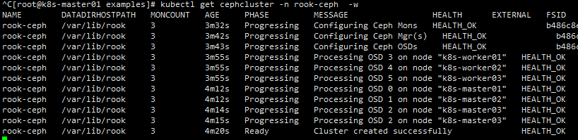

检查pod状态

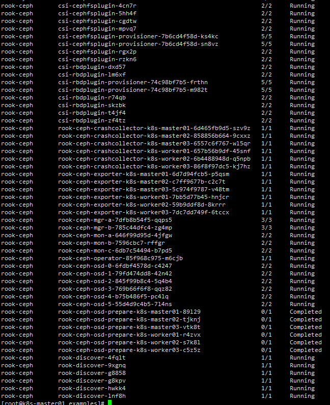

### 部署工具

```bash
kubectl apply -f toolbox.yaml
```

```shell
kubectl exec -it -n rook-ceph rook-ceph-tools-66b77b8df5-b7r22 -- bash
```

```
ceph -s # 检查状态
```

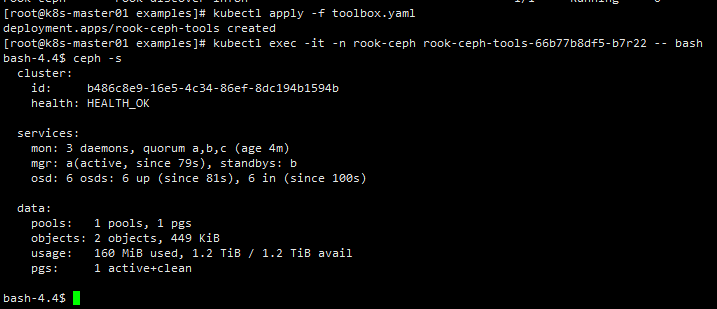

### 部署StorageClass并测试

#### 使用cephfs

CephFS 共享文件系统（Shared Filesystem）适用于多个Pod之间共享读写（RWX）的存储

```
kubectl apply -f filesystem.yaml
```

等待文件系统状态ready

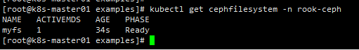

部署storageclass

```
cd csi/cephfs
kubectl apply -f storageclass.yaml
```

检查状态

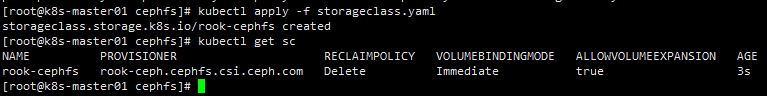

##### 测试cephfs申请动态pvc

```
kubectl apply -f pvc.yaml
```

绑定成功

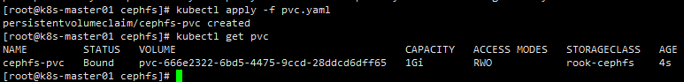

#### 使用rbd存储

块存储（Block）适用于为单个 Pod 提供读写一致性（RWO）的存储

```
cd csi/rbd
kubectl apply -f storageclass.yaml
```

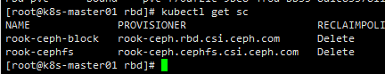

##### 测试rbd申请动态pvc

```
kubectl apply -f pvc.yaml
```

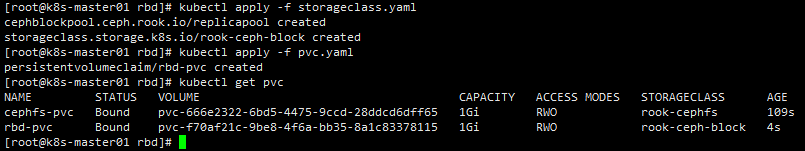

#### 使用对象存储

对象存储（Object）提供了一个可通过内部或外部的Kubernetes集群的S3端点访问的存储

```
kubectl apply -f object.yaml
```

等待状态ready

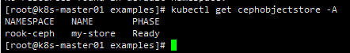

部署storageclass

```
kubectl create -f storageclass-bucket-delete.yaml
```

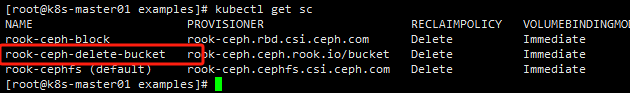

##### 测试使用对象存储

创建OBC对象存储桶

```
 kubectl apply -f object-bucket-claim-delete.yaml
```

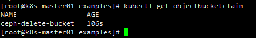

##### 安装测试工具s5cmd

```
wget https://github.com/peak/s5cmd/releases/download/v2.2.2/s5cmd_2.2.2_Linux-64bit.tar.gz
tar -xvf s5cmd_2.2.2_Linux-64bit.tar.gz
mv s5cmd /usr/local/bin/
```

###### 设置凭证

可以使用一下命令生成，或者手动获取OBC同名secret，base64解码获取并写到配置文件

```
export AWS_ACCESS_KEY_ID=$(kubectl -n default get secret ceph-delete-bucket -o jsonpath='{.data.AWS_ACCESS_KEY_ID}' | base64 --decode)
export AWS_SECRET_ACCESS_KEY=$(kubectl -n default get secret ceph-delete-bucket -o jsonpath='{.data.AWS_SECRET_ACCESS_KEY}' | base64 --decode)

mkdir ~/.aws
cat > ~/.aws/credentials << EOF
[default]
aws_access_key_id = ${AWS_ACCESS_KEY_ID}
aws_secret_access_key = ${AWS_SECRET_ACCESS_KEY}
EOF
```

##### 测试获取桶列表

列出当前凭据可以访问的所有桶

```
kubectl get svc -n rook-ceph
```

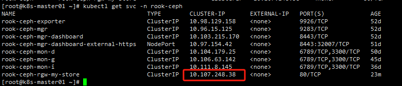

```
s5cmd --endpoint-url  http://10.107.248.38 ls
```

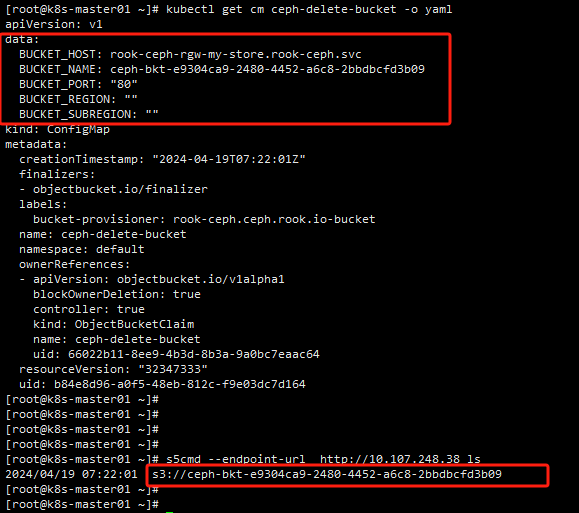

桶名称与configmap对应即可。

## 卸载

清空ceph的pvc资源（根据环境删除）

```
kubectl delete pvc rbd-pvc cephfs-pvc
```

删除storageclass

```
kubectl delete sc rook-cephfs rook-ceph-block
kubectl delete -f filesystem.yaml # 如果没有部署cephfs就不需要删除
```

卸载集群

```
kubectl delete -f cluster.yaml
或者
kubectl delete cephcluster -n rook-ceph rook-ceph
```

卸载工具

```
kubectl delete -f toolbox.yaml
```

卸载operator

```
kubectl apply -f crds.yaml -f common.yaml -f operator.yaml
```

清理磁盘

```
./cleanup.sh /dev/sdx 
```
